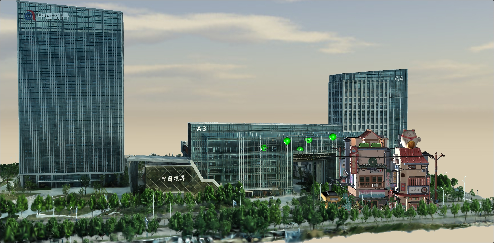
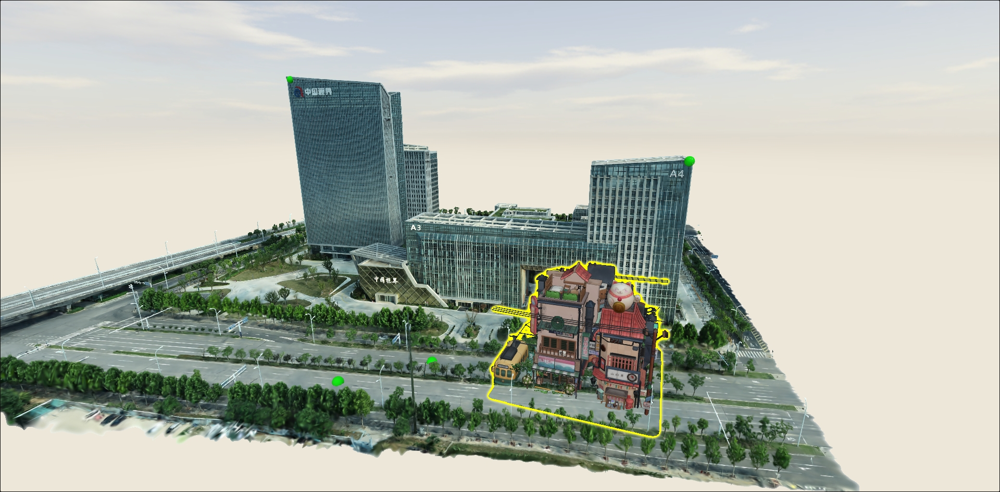

# SenseSpace 3DGS SDK 

        <td><center><video src="https://github.com/user-attachments/assets/75bbf7b8-49cb-43e4-9787-8c32dc83b5db" >demo01</center></td>
        <td ><center><video src="https://github.com/user-attachments/assets/adda70a7-cb86-4a68-b8fa-c339b395c524"  >demo01</center> </td>
        <td ><center><video src="https://github.com/user-attachments/assets/abad4274-b008-402c-95df-efd1444c1ceb"  >demo01</center> </td>
        
# 目录

- [文件结构](#文件结构)
- [功能列表](#功能列表)
- [运行](#运行)
- [Example说明](#Example说明)
- - [集成Babylon.js](#集成Babylon.js)
- - [集成Three.js](#集成Three.js)
- - [集成Cesium.js](#集成Cesium.js)
- [试用申请](#试用申请)
- [更新日志](#更新日志)


  <table>
    <tr>
        <td><center><video src="https://github.com/user-attachments/assets/75bbf7b8-49cb-43e4-9787-8c32dc83b5db" >demo01</center></td>
        <td ><center><video src="https://github.com/user-attachments/assets/adda70a7-cb86-4a68-b8fa-c339b395c524"  >demo01</center> </td>
    </tr>
    <tr>
        <td ><center><video src="https://github.com/user-attachments/assets/abad4274-b008-402c-95df-efd1444c1ceb"  >demo01</center> </td>
    </tr>
</table>


##  文件结构
- data: 需要加载的示例数据
- splat: 3DGS SDK打包好的文件
- examples: 示例
  - babylon: Babylon.js集成示例
  - cesium: Cesium.js集成示例
  - three: Three.js集成示例

  

##  功能列表

### 数据支持
- ply（完整的/去掉球谐法向的）
- splat

### 数据管理
- 异步加载（加载完再渲染）
- 渐进式加载（边加载边渲染）
- 运行时加载/卸载多个数据

### 渲染能力
- 旋转/平移/缩放
- 控制相机内参
- 支持画面resize
- 直接渲染到canvas
- 渲染到纹理（color/depth）
- ClipPlanes区域裁切
- 实时过滤相机后面的点

### 外部集成能力
- 支持Cesium.js/Three.js/Babylon.js/原生WebGL
- 基于depth纹理做遮挡
- Raycast拾取（Three.js/Babylon.js）
- 经纬高度坐标拾取（Cesium.js）
- 多Paas渲染（如天空盒、描边特效）
- 外部交互同步
- 外部坐标系同步（WGS84）


## 运行
在3DGS-SDK根目录下起一个http服务器（端口随意），即可访问examples下的示例


## Example说明

详细使用请参考各示例程序的说明，接口API文档`splat/splat.d.ts`

```javascript
/// 创建3DGS场景
const splatScene = new SPLAT.Scene(canvas);
const splatCamera = splatScene.camera;
splatCamera.setControlEnabled(false); // 禁用3DGS相机自带的交互，以外部交互为准
let splatRenderTarget;

/// 加载3DGS数据
const splatUrl = "../data/hefei/hefei_0429_3DGS_cut.splat";
const splat = SPLAT.Loader.LoadIncrementally(splatUrl, splatScene, 
    (splat) => {
        console.info("load finish", splat);
    },
    (progress) => {
        if (!splatRenderTarget) {
            splatRenderTarget = new SPLAT.RenderTarget(splat);
        }
        splatRenderTarget.addSplat(splat);
        console.info("load progress " + progress);
    },
    (error) => {
        console.error("load error " + error);
    }
);

/// 获取Color和Depth纹理
const retrieveTextures = () => {
    if (splatRenderTarget && !splatColorTexture) {
        splatColorTexture = splatRenderTarget.colorTexture;
    }
    if (splatRenderTarget && !splatDepthTexture) {
        splatDepthTexture = splatRenderTarget.depthTexture;
    }
}
```

### 集成Babylon.js

示例程序位于`examples/babylon`，入口为`index.js`，创建了一个简单的Babylon场景和一个3DGS场景。先渲染3DGS场景，获取了3DGS渲染的颜色纹理和深度纹理，使用`bufferWriter.js`将纹理写入画面，再渲染Babylon场景，基于已写入的深度缓冲做深度测试。双击时根据3DGS深度纹理计算深度，摆放小球。



```javascript
/// examples/cesium/index.js
/// ...

/// 初始化BufferWriter实例
const bufferWriter = new BufferWriter();
bufferWriter.init(gl);

/// 将Babylon的位姿和投影参数同步给3DGS相机
const syncCamera = () => {
    /// ...
}

/// 渲染逻辑回调
const render = () => {
    /// 更新交互相机
    bblInputCamera.update();

    /// 同步Babylon相机和3DGS相机的参数
    syncCamera();

    /// 渲染3DGS场景
    splatScene.resetStates();
    splatScene.render();

    /// 将3DGS渲染结果写入buffer
    if (splatColorTexture && splatDepthTexture) {
        const splatCamData = splatCamera.data;
        bufferWriter.write(splatColorTexture, splatDepthTexture, splatCamData.near, splatCamData.far, bblCamera.getProjectionMatrix().m);
    }

    /// 渲染Babylon场景
    bblEngine.wipeCaches(true);
    bblScene.render();
};

/// 鼠标双击raycast
const handleDoubleClick = (event) => {
    /// ...
}

// ...
```

### 集成Three.js

示例程序位于`examples/three`，入口为`index.js`，创建了一个简单的Three.js场景和一个3DGS场景。先渲染3DGS场景，获取了3DGS渲染的颜色纹理和深度纹理，使用`bufferWriter.js`将纹理写入画面，再渲染Three.js场景，基于已写入的深度缓冲做深度测试。双击时根据3DGS深度纹理计算深度，摆放小球。



```javascript
/// examples/babylon/index.js
/// ...

/// 初始化BufferWriter实例
const bufferWriter = new BufferWriter();
bufferWriter.init(gl);

/// 将Three.js的位姿和投影参数同步给3DGS相机
const syncCamera = () => {
    /// ...
}

/// 渲染逻辑回调
const render = () => {
    /// 同步Three.js相机和3DGS相机的参数
    syncCamera();

    /// 获取动画时间参数
    const animDelta = clock.getDelta();

    /// 渲染3DGS场景
    splatScene.resetStates();
    splatScene.render();

    /// 将3DGS渲染结果写入buffer
    if (splatColorTexture && splatDepthTexture) {
        const splatCamData = splatCamera.data;
        bufferWriter.write(splatColorTexture, splatDepthTexture, splatCamData.near, splatCamData.far, threeCamera.projectionMatrix.elements);
    }

    /// 渲染Three.js场景
    threeRenderer.resetState();
    mixer?.update(animDelta);
    threeRenderer.render(threeScene, threeCamera);
    threeRenderer.resetState();

    /// 渲染描边特效
    threeRendererEffect.resetState();
    mixerEffect?.update(animDelta);
    composer.render();
    threeRendererEffect.resetState();
};

/// 鼠标双击raycast
const handleDoubleClick = (event) => {
    /// ...
}

// ...
```

### 集成Cesium.js

示例程序位于`examples/cesium`，入口为`index.js`，创建了一个简单的Cesium场景和一个3DGS场景，分别获取了Cesium和3DGS渲染的颜色纹理和深度纹理，使用`blender.js`将4张纹理进行混合，输出到最终画面。


```javascript
/// examples/cesium/index.js
/// ...

/// 初始化用于融合Cesium和3DGS纹理的Blender实例
const blender = new Blender();
blender.init(gl);

/// 初始化CesiumAligner，用于同步Cesium和3DGS的相机，并加载配置文件
const aligner = new SPLAT.CesiumAligner();
aligner.loadAttr("../data/hefei/hefei_0429_model_attrs.json");

/// 渲染逻辑回调
const render = () => {
    /// 渲染Cesium场景
    // ...

    /// 根据Cesium相机同步3DGS相机
    aligner.syncSplatCamera(cesiumViewer, splatCamera);

    /// 渲染3DGS场景
    splatScene.resetStates();
    splatScene.render();

    /// 融合Cesium和3DGS渲染的渲染结果
    if (cesiumColorTexture && cesiumDepthTexture && splatColorTexture && splatDepthTexture) {
        const cesiumFrustum = cesiumViewer.scene.context.uniformState.currentFrustum;
        const splatCamData = splatCamera.data;
        blender.blend(
            cesiumColorTexture, cesiumDepthTexture, cesiumFrustum.x, cesiumFrustum.y,
            splatColorTexture, splatDepthTexture, splatCamData.near, splatCamData.far
        );
    }
};

// ...
```

##  试用申请


##  更新日志

### v0.7.0
- 同步最新版本的3DGS实现，有性能优化
- Three.js示例程序，增加描边特效
- Cesium.js示例程序，增加经纬高度拾取，支持标签的正确遮挡

### v0.6.1
- 将worker打包到sdk内部，不再作为独立脚本
- 优化排序性能，减少从GPU读取距离buffer的时间

### v0.6.0
- 支持ClipPlanes裁切场景
- 优化3DGS场景深度
- 开放CameraData类接口，完善SplatData接口实现
- 增加Three.js/Babylon.js集成示例（模型遮挡、天空盒、拾取）
- 支持PLY加载（仍建议优先使用SPLAT文件）

### v0.5.0
- 使用了3DGS编辑器使用的GaussianSplatting实现
- 支持与Cesium集成，并增加集成示例
